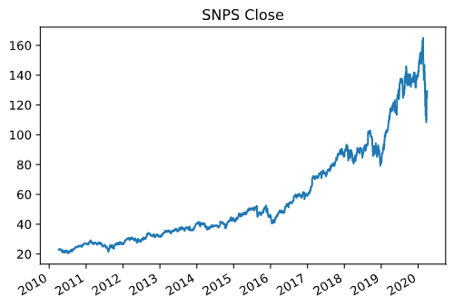
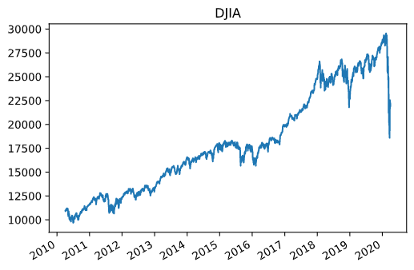
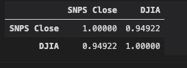
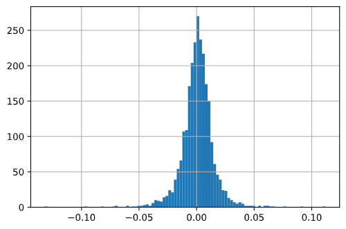
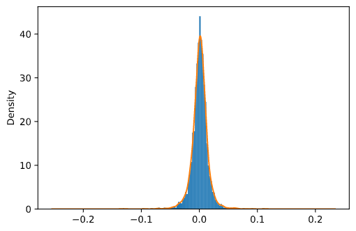
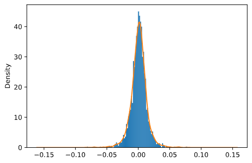
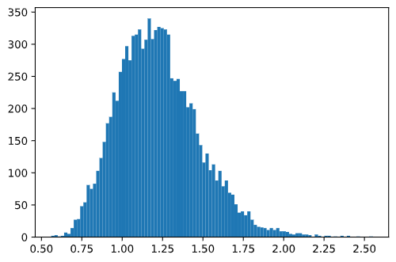

Synopsys 股价和模型分析

## Synopsys 10年股价走势

收集了Synopsys最近10年的股票价格，对这个股票做一个股价及其模型的分析。近10年的收盘价请看上图

## Synopsys 股价和道琼斯指数的关系

我们来看看最近10年道琼斯指数的趋势。首先，对比Synopsys的趋势图，我们能看到道琼斯指数和Synopsys股价的走势有相当大的相似性，这就给来我们一个直观感性认识：这两者有相当大的相关性。 但具体是多少呢？通过计算，我们可以看到两者的相关性高达<u>**0.949**</u>

## Synopsys 股票模型
我们再来看看Synopsys股票每天的增长率。我们画出来股票最近10年(一直到2020.3.31)每个交易日收盘时候的增长率的直方图

我们可以考虑用这个直方图来拟合股价增长率的概率分布图，一共2514个交易日，所以我使用高斯核密度估计来拟合分布，看下图的黄色曲线，就是得到的核密度估计曲线

## Synopsys 股票的蒙特卡洛分析

我们就用拟合出来的分布作为我们随机数采样的概率密度函数。首先用2010-2019.03.29的增长率数据来做核密度估计，如下图，其实和2010-2020的核密度曲线具有很大的相似性

2019.03.29到2020.03.31 一共有253个交易日。那么我们从拟合出来的分布中，采样253个随机数，即每个交易日的股票增长率。然后计算出2020.03.31这一天的股票收盘价格相对于2019.03.29的涨幅或者收盘价格。

这样的过程我们做10000次的[蒙特卡洛](https://baike.baidu.com/item/蒙特卡罗法/1225057?fr=aladdin)法分析，即获得10000次这一天的股票收盘价格，画出直方图见下图，计算出一些统计特征数据。

| 统计特征| |
| --- | --- |
 count | 10000.000000 |
 mean | 1.223920
 std | 0.252363 
min  |    0.560751 
25%   |       1.041935 
50%   |       1.202437 
75%   |       1.378551 
max   |       2.550399 

我们可以清楚的看到2020.03.31这一天收盘价相对于2019.03.29收盘价涨幅的分布图。2019.03.29这一天的收盘价是115.15美元，从上表可以看出2020.03.31日的预测在2019.03.29这一天的0.56倍到2.55倍之间即（64.484至164.77美元)。平均值是1.22倍，25%的概率小于1.04倍，75%的概率小于1.378倍。而我们来看看2020.03.31真实的收盘价是128.79美元， 是115.15的1.118倍，是接近中位数1.202437的。

## Synopsys股票未来一年的预测

相同的，我们用2010-2020.3.31的核密度估计来作为随机数采样的发生器。假设一年的交易日250个交易日，我们从发生器采样250个随机数作为2020.03.31以后250个交易日每天的增长率，计算出250个交易日以后，大概在2021.03.31左右的收盘价。把这个过程同样做10000次蒙特卡洛分析，得到如下直方图和下表的结果

| 统计特征| |
| --- | --- |
count  |  10000.000000
mean   |      1.216145
std    |      0.281482
min    |      0.478381
25%    |      1.014744
50%    |      1.186467
75%    |      1.385290
max    |      3.282756

根据这个结果和2020.3.31号收盘价128.79美元，我们可以对未来一年以后（250个交易日）也就是2021.3.31前后的股票做一个预测。25%的几率是小于1.01倍的，中位数是1.186倍，也就是152美元。

当然最近covind-19疫情的影响，股票价格起伏非常大，给关注这支股票的人做个参考。欢迎大家来跟我讨论。
Email: fanyishu123@outlook.com

文章，源码和数据，请移步github:
